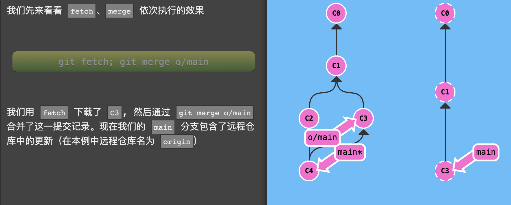

#### Git 常用命令：

```js
// 创建分支xxx Mac修改
git branch XXX

// 切换到xxx分支 && 将HEAD指定对应的提交版本
// 首先看看操作符 (^)。把这个符号加在引用名称的后面，表示让 Git 寻找指定提交记录的父提交。
//所以 main^ 相当于“main 的父节点”。git checkout main^
//main^^ 是 main 的第二个父节点 git checkout main^^
// 也可以将 HEAD 作为相对引用的参照。下面咱们就用 HEAD 在提交树中向上移动几次。 git checkout HEAD^
git checkout xxx && git checkout <版本的哈希值>
  
// 使用相对引用最多的就是移动分支。可以直接使用 -f 选项让分支指向另一个提交。例如:命令会将 main 分支强制指向 HEAD 的第 3 级父提交。
git branch -f main HEAD~3
// 提交代码
git commit

// 将xxx分支的代码合并到当前分支上
git merge xxx

// Rebase 实际上就是取出一系列的提交记录，“复制”它们，然后在另外一个地方逐个的放下去。对应的是在当前分支上做操作
git rebase xxx

// 主要有两种方法用来撤销变更 —— 一是 git reset，还有就是 git revert
// 和提交一样，撤销变更由底层部分（暂存区的独立文件或者片段）和上层部分（变更到底是通过哪种方式被撤销的）组成。我们这个应用主要关注的是后者
// git reset 通过把分支记录回退几个提交记录来实现撤销改动。你可以将这想象成“改写历史”。git reset 向上移动分支，原来指向的提交记录就跟从来没有提交过一样。把分支移回到HEAD上一个版本；现在我们的本地代码库根本就不知道有 原来的HEAD 这个提交了
git reset HEAD~1
// 虽然在你的本地分支中使用 git reset 很方便，但是这种“改写历史”的方法对大家一起使用的远程分支是无效的哦！为了撤销更改并分享给别人，我们需要使用 git revert
// 在我们要撤销的提交记录后面居然多了一个新提交！这是因为新提交记录 C2' 引入了更改 —— 这些更改刚好是用来撤销 C2 这个提交的。也就是说 C2' 的状态与 C1 是相同的。revert 之后就可以把你的更改推送到远程仓库与别人分享啦。
git revert HEAD

// git cherry-pick <提交号>... 如果你想将一些提交复制到当前所在的位置（HEAD）下面的话， Cherry-pick 是最直接的方式了
// 我们只需要提交记录 C2 和 C4，所以 Git 就将被它们抓过来放到当前分支下了
git cherry-pick C2 C4

远程操作：
// 将远程厂库克隆到本地 远程分支有一个特别的属性，在你检出时自动进入分离 HEAD 状态。Git 这么做是出于不能直接在这些分支上进行操作的原因, 你必须在别的地方完成你的工作, （更新了远程分支之后）再用远程分享你的工作成果
git clone

// 将远程厂库的信息获取到本地分支，但是并没有改变本地的厂库，改变的是本地的分支 当远程分支中有新的提交时，你可以像合并本地分支那样来合并远程分支 看下图：
git fetch

// 于先抓取更新再合并到本地分支这个流程很常用：git pull 就是 git fetch 和 git merge 的缩写！
git pull


```




测试从test_branch分支提交内容