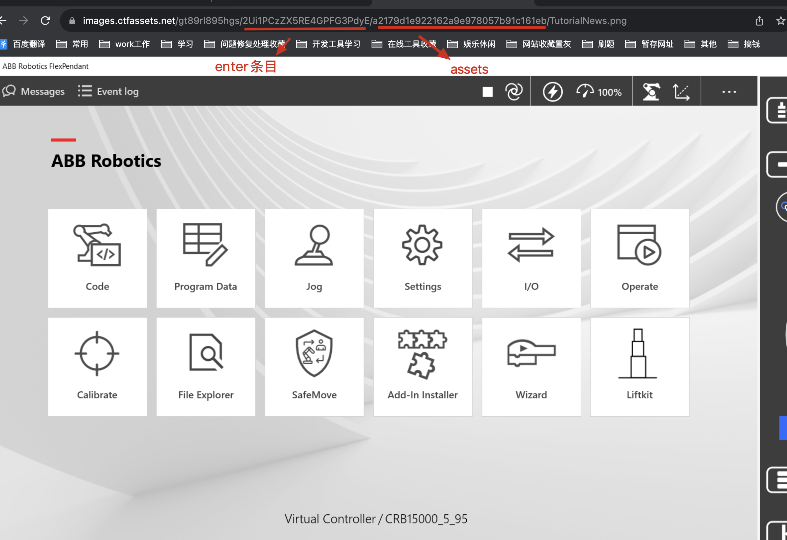

### 介绍：

这个脚本是一个使用 Azure Storage Blob 服务进行文件上传和管理的 Node.js 脚本。它提供了函数来遍历文件夹并将其中的资源上传到 Azure Blob 容器，并且根据文件类型设置了适当的内容类型。

### 使用：

```js
node index.js
```

### AzureBlob.js 脚本分析：

1. 引入模块和设置连接字符串：
   - 脚本首先引入了 `@azure/storage-blob` 模块用于与 Azure Storage Blob 进行交互，还引入了 `fs` 和 `path` 模块用于文件系统操作和路径处理。
   - `connectionString` 包含了连接 Azure Storage Blob 的必要信息，包括账户名和账户密钥。

2. 创建 `BlobServiceClient` 实例：
   
- 使用提供的连接字符串创建了一个 `BlobServiceClient` 实例，这将用于与 Azure Storage Blob 服务进行通信。
   
3. 定义容器名称：
   
- `containerName` 包含了将要存储上传文件的容器的名称。
   
4. `uploadFile` 函数：
   
   - 这个函数用于上传文件到 Blob 容器，并可以设置内容类型。
   - 使用提供的 `blockBlobClient`（BlockBlobClient 实例）、`filePath`（要上传的文件路径）和 `contentType`（文件的内容类型）参数来执行上传操作。
- 上传文件时可以设置文件的内容类型（如图片、视频等）
   
5. `determineContentType` 函数：
   
   - 这个函数根据文件的扩展名来判断文件的内容类型。
- 通过比较文件的扩展名（例如 `.json`、`.jpg` 等），决定返回适当的 MIME 类型。
   
6. `uploadResourcesToBlobContainer` 函数：

   - 这个函数用于遍历指定的文件夹，并将其中的资源上传到 Blob 容器中。
   - 通过读取文件夹中的文件列表，然后根据文件类型使用 `determineContentType` 函数来确定文件的内容类型，最后调用 `uploadFile` 函数进行文件上传。

   

   ### 使用介绍：

   ```
   node index.js  // 先执行获取当前CMS服务器上所有active的资源，数据保存在outputData.json中
   
   node downloadCMS.js  // 下载服务器上对应 outputData.json中的所有assets数据
   ```

   

   ### Index.js

   ​	通过 Contentful 的 API 获取内容类型和资源数据，并分析与条目关联的资源 ID，最终将下载的资源 ID 和与条目关联的资源 ID 存储到一个 JSON 文件中，以供进一步下载处理。

   脚本的主要步骤如下：

   4. 定义三个异步函数：

      - `getContentTypes()`: 通过 Contentful API 获取所有的内容类型，并返回内容类型的数组。
      - `getEntries(contentTypeId)`: 根据给定的内容类型 ID，通过 Contentful API 获取该内容类型的所有条目，并返回条目数组。
      - `getAllAssets()`: 获取所有的资源（assets）数据，并返回资源数组。

   5. 定义主函数 `main()`：

      - 首先，通过调用 `getContentTypes()` 和 `getAllAssets()` 函数获取内容类型和资源数据。
      - 创建两个空的 Set，分别用于存储已下载的资源 ID 和与条目关联的资源 ID。
      - 循环遍历每个内容类型，获取其所有条目，并筛选出与条目关联的资源 ID，然后将这些资源 ID 添加到 `entry_Assets` 集合中。
      - 对于所有的资源，将它们的 ID 添加到 `downloadedAssets` 集合中，用于标记已下载的资源。
      
   6. 在 `main()` 函数的结尾，将 `downloadedAssets` 和 `entry_Assets` 数据保存到一个 JSON 文件中。首先将这些数据转换为字符串数组，然后构建一个对象，包含这两个数组，最后将该对象写入 JSON 文件中。

   

   ### downloadCMS.js

   这个脚本的功能是根据提供的资源 ID，通过 Contentful API 下载对应的资源文件，并将其保存到指定的文件夹中进行备份。

   3. 定义备份文件的路径和文件名：
      - `filePath`：要读取的 JSON 文件路径（包含已下载资源的信息）。

   4. 定义下载资源的核心函数 `downloadAsset`：
      - 使用 `axios` 发送 GET 请求获取资源文件的二进制数据。
      - 检查本地是否已存在相同文件，如果存在则跳过下载。
      - 将获取的二进制数据写入指定文件路径。

   5. 定义主函数 `main`：
      - 创建一个空的 Set 用于存储已下载的资源 ID。
      - 定义递归函数 `recursiveDownload` 来逐个下载资源。
      - 从 `AllAsstesIds` 数组中获取一个资源 ID。
      - 如果资源已经下载，跳过并处理下一个资源。
      - 通过 API 请求获取资源数据，其中包括文件的 URL。
      - 调用 `downloadAsset` 函数下载资源文件，将资源 ID 添加到已下载的 Set 中。
      - 递归调用 `recursiveDownload` 函数下载下一个资源。

   6. 读取 JSON 文件并解析数据：
      - 使用 `fs.readFile` 读取指定路径的 JSON 文件。
      - 尝试将 JSON 数据解析为 JavaScript 对象。
      - 将已下载的资源数组赋值给 `AllAsstesIds`。
      - 调用 `main` 函数开始下载资源。
      - 

   ### CMS URL 示例：（条目下关联的某个具体的 assets）

   


