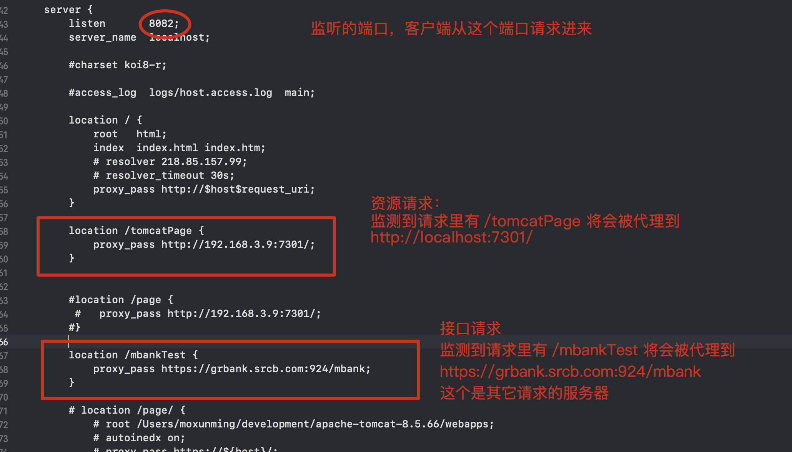

#### nginx 常用指令：

- nginx：启动
- nginx -s stop  ：停止
- nginx -s reload：重载
- ps -f | grep nginx：查看进程
- nginx -t  :查看Nginx的路径信息

浏览器处于安全考虑，会通过同源策略禁止网页发起跨域的http请求。
       同源策略： URL由协议、域名、端口和路径组成，如果两个URL的协议、域名和端口相同，则表示它们同源。

##### 1 . 正向代理：

代理位于网站和客户端中间，客户端无法访问某网站，就将请求发送给代理服务器，代理从网站取回来再发送给客户端，网站并不知道为谁提供服务

作用 ：正向代理隐藏了用户，用户的请求被代理服务器接收代替，到了服务器，服务器并不知道用户是谁。
用途 ：当客户端无法访问外部资源的时候（由于诸如墙这样的原因），可以通过一个正向代理去间接地访问，所以客户端需要配置代理服务器的ip。
正向代理是一个位于客户端和原始服务器(origin server)之间的服务器，为了从原始服务器取得内容，客户端向代理发送一个请求并指定目标(原始服务器)，然后代理向原始服务器转交请求并将获得的内容返回给客户端。客户端必须要进行一些特别的设置才能使用正向代理。

##### 2 . 反向代理：

客户端访问某网站的一个页面,但是网站并没有，就偷偷从另外一台服务器上取回来,然后作为自己的内容吐给用户，用户不知道真正提供服务的是谁

作用 ：用户请求过多，服务器会有一个处理的极限。所以使用反向代理服务器接受请求，再用均衡负载将请求分布给多个真实的服务器。既能提高效率还有一定的安全性。
用途 ：如果不采用代理，用户的IP、端口号直接暴露在Internet（尽管地址转换NAT），外部主机依然可以根据IP、端口号来开采主机安全漏洞，所以在企业网，一般都是采用代理服务器访问互联网。

##### 3 . nginx通过反向代理解决跨域问题

对于浏览器来说，访问的就是同源服务器上的一个url。而nginx通过检测url前缀，把http请求转发到后面真实的物理服务器。并通过rewrite命令把前缀再去掉。这样真实的服务器就可以正确处理请求，并且并不知道这个请求是来自代理服务器的。

简单说，nginx服务器欺骗了浏览器，让它认为这是同源调用，从而解决了浏览器的跨域问题。又通过重写url，欺骗了真实的服务器，让它以为这个http请求是直接来自与用户浏览器的。

电脑本地启动Tomcat：端口号 7301，启动Nginx：端口8082

手机使用局域网去访问电脑本地的Nginx8082端口，通过反向代理将请求代理到本地的Tomcat服务器文件中，在Tomcat前端文件内部接口的请求路径是公网的接口（https://test1.srcb.com:538），通过Nginx代理接口请求到其他的服务器，在手机客户端这边则不会出现跨域问题，展示出来是Nginx服务器的请求，没有改变同源策略。

本地Nginx配置文件内容：

