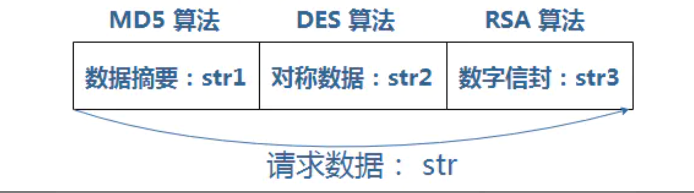

三段式加密，顾名思义，就是数据传输过程中，加密数据由三段（数据摘要 + 对称加密数据 + 数字信封）组成。三段分别采用以上三种类型的加密算法。

对称算法与非对称算法的优缺点：

- 对称算法效率高，但由于其密钥暴露，安全性低
- 非对称算法只暴露公钥，私钥保密，所以其安全性比对称加密高，但其效率低

三段式加密算法则采其众所长，利用对称算法对明文数据进行加密、非对称算法对对称密钥进行加密，即保证了加密效率，也保障了密钥的安全性

示例采用 [MD5](https://www.jianshu.com/p/74ab01bd6f29) + [DES](https://www.jianshu.com/p/e94319c1fa45) +[RSA](https://www.jianshu.com/p/10c1c22823a2)  三种算法。

在数据传输前，请求方和服务方会约定一对公私钥，请求方持有公钥（publicKey），服务方持有私钥（privateKey）；
 对称密钥（desKey）由请求方随机生成。

str1 = MD5( 明文 text + desKey )；

str2 = DES( 明文 )；

str3 = RSA( publicKey ， desKey )；

三段之间一般的分隔符 split 一般采用 char 29 ；

str = str1 + split + str2 + split + str3 ；

服务方接受到数据之后，处理步骤如下：

1. 以 分隔符(char 29) 对请求密文数据 str 进行分割，得到 str1、str2、str3；
2. 用约定的非对称私钥(privateKey) 对str3 进行解密，获得 DES密钥明文 desKey；
3. 用 desKey 对 str2 进行解密，获得明文 text；
4. 对明文 text 与 对称密钥 desKey 之和 进行 MD5加密；
5. 将步骤4所得结果与 str1 进行比较：
    如果相同，则数据处理完成；
    如果不同，则可能数据在传输过程中有可能篡改，数据处理失败；