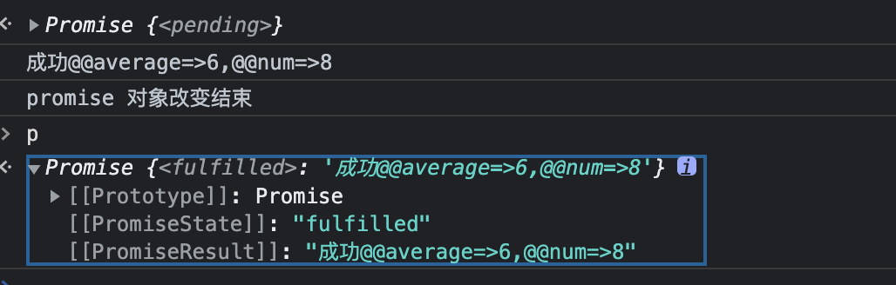

#### Prmoise基础

Promise是一个构造函数，内部方法存在resolve、reject、race等静态方法，原型对象上存在then、catch方法；使用new创建一个promise对象时传入一个参数，是个函数，内部传递两个参数，resolve和reject，代表成功回调和失败的回调。


promise的三种状态：

1. pending：初始状态
2. fulfilled：成功完成状态
3. rejected：失败的完成状态

当在promise函数中调用resolve方法，会使该promise对象的状态由pending改变为fulfilled状态，且用then去接收resolve内部传递来的数据；当在promise函数中调用reject方法，promise对象的状态由pending改变为rejected状态，用catch去捕获这个reject方法传递的数据。

```js
var p = new Promise(function(resolve,reject){
  //创建一个异步的方法,获取范围内的随机数大小和平均值比较
  var Min= 1,Max=10;
  setTimeout(function RandomNumBoth(){
      var Range = Max - Min;
      var Rand = Math.random();
  		var average = Math.ceil((Max+Min)/2);
      var num = Min + Math.round(Rand * Range); //四舍五入
      if(average<num){
         	resolve("成功@@average=>"+average+",@@num=>"+num)
         }else{
        	reject("失败@@average=>"+average+",@@num=>"+num)
      }
  },2000)
});
p.then((data)=>{
  console.log(data);
}).catch((err)=>{
  console.log(err);
}).finally(()=>{
  console.log("promise 对象改变结束");
})
```




上图所示的失败和成功的返回及其改变的状态。

##### 注意一点：

当我们没有去主动的调用这个新创建的promise的时候，内部的异步操作已经被执行，所以我们通常将这个p放在函数A内部去调用，在需要执行的时候去调用封装的这个函数A。

```js
function A(Min,Max){
  var p = new Promise(function(resolve,reject){
    //创建一个异步的方法,获取范围内的随机数大小和平均值比较
    setTimeout(function RandomNumBoth(){
        var Range = Max - Min;
        var Rand = Math.random();
        var average = Math.ceil((Max+Min)/2);
        var num = Min + Math.round(Rand * Range); //四舍五入
        if(average<num){
            resolve("成功@@average=>"+average+",@@num=>"+num)
           }else{
            reject("失败@@average=>"+average+",@@num=>"+num)
        }
    },2000)
  });
  // 需要将p给返回出去调用
  return p;
};
// 可以传递参数供内部promise对象使用
A(2,8).then((data)=>{
  console.log(data);
}).catch((err)=>{
  console.log(err);
}).finally(()=>{
	console.log("promise 对象改变结束");
})
```

#### promise的all、race方法：

all：将执行完全部的promise函数对象才会执行它的then或catch方法；调用catch时会停止内部还没完成的promise函数执行

race：内部函数其中之一被执行将立刻执行它的then或catch方法，且不影响其他还未执行完成的promise函数；

```js
var A = function(Max,Min,Key,Time){
  return new Promise(function(resolve,reject){
    setTimeout(function RandomNumBoth(){
      var Range = Max - Min;
      var Rand = Math.random();
      var average = Math.ceil((Max+Min)/2);
      var num = Min + Math.round(Rand * Range); //四舍五入
      if(average<num){
        resolve(Key+"成功@@average=>"+average+",@@num=>"+num)
      }else{
        reject(Key+"失败@@average=>"+average+",@@num=>"+num)
      }
    },Time)
  })
};

// 接收的数据data：只有在内部promise对象都成功才会执行then，且data数据是内部三个函数的resolve数据的数组形式给到，当其中一个A函数执行了reject，Promise.all将会立即执行.catch方法，且会停止执行后面还没触发的A函数（then触发是全部的）
Promise.all([A(1,8,"A1",1000),A(1,5,"A2",500),A(1,63,"A3",800)]).then((data)=>{
  console.log(data);
}).catch((err)=>{
	console.log(err);
})
// 和all相反；接收的数据data：只要内部promise对象有成功就会执行then，且data数据是内部最先调用函数的resolve数据，当其中一个A函数执行了resolve或者reject，Promise.race将会立即执行对应的.then.catch方法，且会停止执行后面还没触发的A函数。（就看内部A谁执行的最快，下面例子是会一直以A2的数据作为Promise的返回值去执行，因为这个异步函数是最快的。）
Promise.race([A(1,8,"A1",1000),A(1,5,"A2",500),A(1,63,"A3",800)]).then((data)=>{
  console.log(data);
}).catch((err)=>{
	console.log(err);
})
```


#### promise和observible区别

Observable 是 lazy 的，只有订阅才输出，同时 Observable 可以接受多个值。Promise 只能 resolve 一次。

Promise 内部 resolve 一定是异步的，而 Observable 则可以自由发挥

Promise 只会执行一次，创建之后就会执行，不能重复执行，而 Observable 每订阅一次会执行一次，而如果想只执行一次，可以利用 share。

Promise 不可以取消，而 Observable 可以取消

