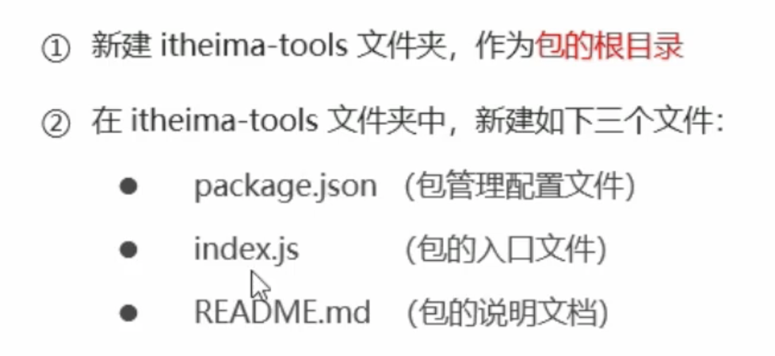
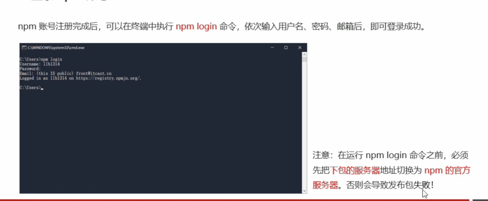
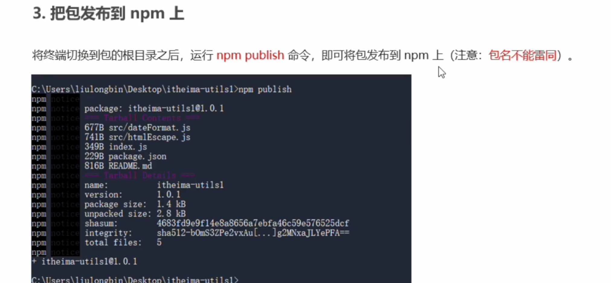
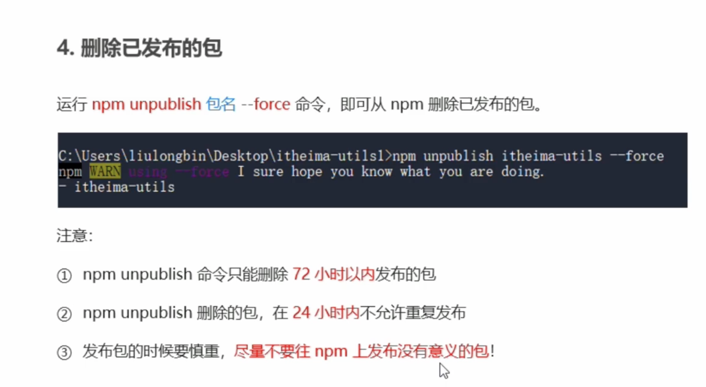
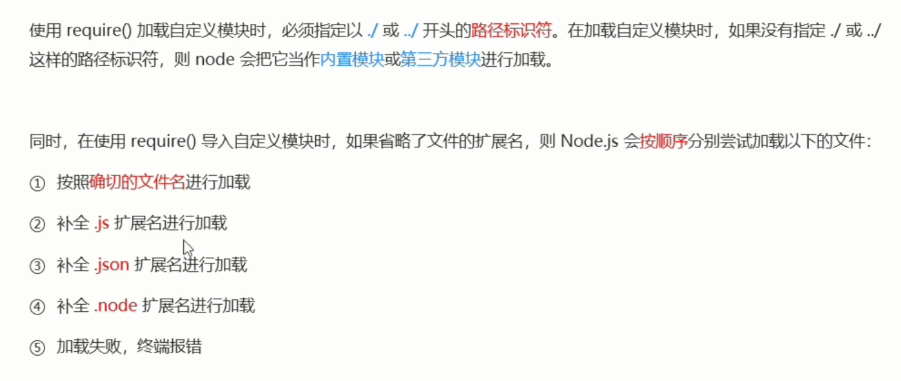
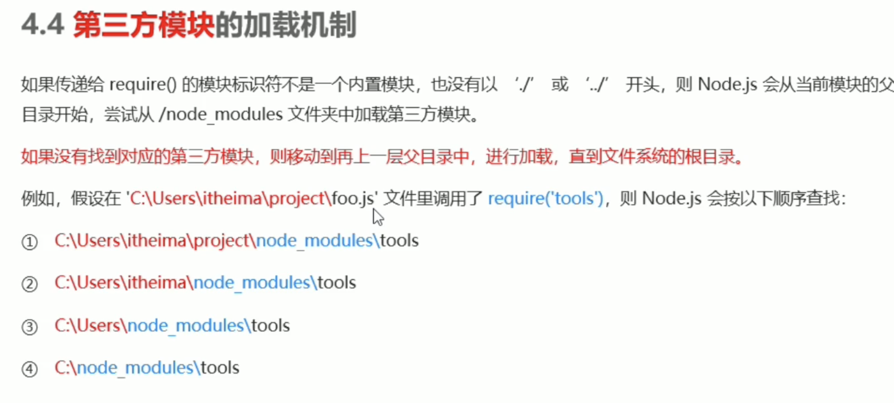

#### 包管理：

npm init -y ：快速创建包管理文件 package.json，该命令只能在英文的文件夹下执行

npm install xxx：会自动的将xxx包的信息记录到package.json中

dependencies：package.json中显示哪些包使用 npm install 安装的

#### 管理 nrm 使用：

nrm ls：查看所有可用的镜像资源

nrm use taobao ：切换为淘宝镜像资源

#### 包规范结构

包必须以单独的文件目录存在

包的顶级目录下要包含 package.json配置文件

package.json中包含 name version main 三个属性标识包名，版本号，包入口

#### 自定义npm包上传

#### 模块加载机制

有缓存加载，同个文件内多次require（）导入一个模块，这个模块只会被加载一次，后面都是缓存。

内模块加载机制：内模块优先级最高，当外部存在和module内部一样的模块时，require（）始终是导入的module内部的模块

在使用require（）没有使用 ./ 或 ../ 这种路径加载的默认是 module内部的模块

