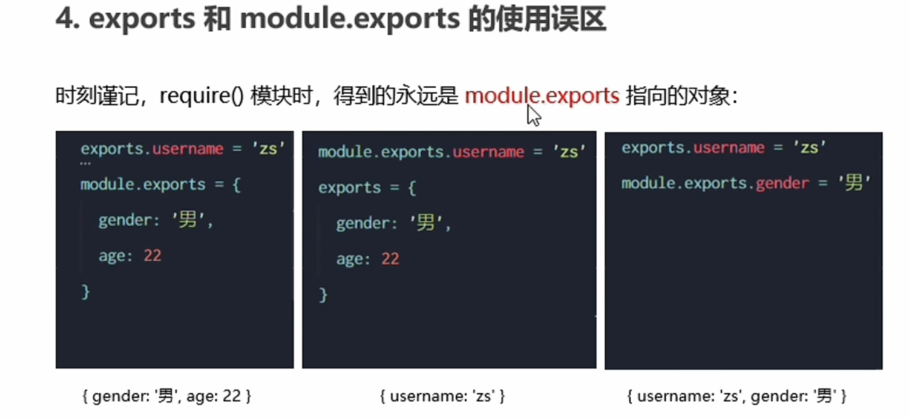

Node.js 学习路径：

JavaScript 基础语法 + node.js 内置API模块（fs、path、http等）+ 第三方API模块（express、mysql）

#### Fs常用API：readFile  writeFile

```js
const fs = require('fs');
// 使用 ./ ../ 运行时会执行node命令所处的目录，动态的拼接被操作的文件路径
/*fs.readFile('1.txt','utf-8',function(err,data){
    if (err) throw err;
    console.log(data);
});
// 写入原有存在的会直接替换掉
var writeData = "Hello node.js";
fs.writeFile('1.txt', writeData, (err) => {
    if (err) throw err;
    console.log('The file has been saved!');
});
fs.readFile('1.txt','utf-8',function(err,data){
    if (err) throw err;
    console.log(data);
});*/

console.log(__dirname); // __dirname 当前文件的路径地址
fs.readFile(__dirname+'/achievement.txt','utf-8',(err,data)=>{
    if (err) throw err;
    try {
        // string正则匹配替换，分割为一个数组
        const newArrString = data.replace(/[=]/g,':').split(" ");
        // 使用数组插入换行标识；
        const achievement = newArrString.join('\r\n');
        console.log(achievement);
        fs.writeFile('achievement副本.txt',achievement,'utf-8',(err)=>{
            if (err) throw err;
            console.log("success - achievement副本.txt")
        })
    }catch (e) {
        console.log(e);
    }
})
```


#### path路径模块：join、basename、pathExtname

```js
const path = require('path');

// path.join([...path]) 可以把多个路径片段拼接为完整的路径字符串
const pathStr = path.join('/a','/b/c','../','./d','e');
console.log(pathStr); // '../' 这个会将上一个路径给处理掉
// 涉及到路径拼接的操作使用 path.join（）方法处理；
const pathStr2 = path.join(__dirname,'1.txt');
console.log(pathStr2); // 通常使用这种方式来执行对应的文件（规范）

// 使用path.basename（）方法可以获取路径的最后部分，通常获取路径中的文件名
// path.basename(path[,ext]); path:必选参数，标识一个路径的字符串，ext：可选参数，表示文件扩展名
const pathFile = 'a/b/c/d.html';
const pathBase1 = path.basename(pathFile);
console.log("pathBase1:"+pathBase1); // pathBase1:d.html
const pathBase2 = path.basename(pathFile,'.html');
console.log("pathBase2:"+pathBase2); // pathBase2:d

// path.extname() 获取路径中的扩展名部分
const pathExtname = path.extname(pathFile);
console.log(pathExtname); // .html
```


#### http模块：用来创建web服务器的模块，通过http.createServer（）方法，能方便的把一台普通的电脑，变成一台web服务器，对外提供web资源服务。

```js
const http = require("http");
// 创建服务器实例
const server = http.createServer();
/*
* 为服务器实例绑定request事件，监听客服端发送的网络请求
* req:请求对象，（包含和客户端相关的数据或属性）
*   只要服务器接收到了客户端的请求，就会调用server.on（）为服务器绑定的request事件处理函数
*   若想在事件处理函数中 访问于客户端相关的数据或属性，可以使用以下方式：
*   req.url:客户端请求的URL路径
*   req.method：客户端请求的类型
*
* res:响应对象，（包含和服务端相关的数据或属性）
* res.end()方法，向客户端发送指定内容，并结束这次请求的处理
*   注意使用end()方法发送中文会出现乱码问题，需要手动设置内容的编码格式
* */
server.on('request',(req,res)=>{
    console.log('someone viste our web serve');
    const stringBody = `客户端发起请求的url:${req.url} 和 method: ${req.method}`;
    // 需要手动设置内容的编码格式处理出现乱码问题
    res.setHeader('Content-Type','text/html; charset=utf-8');
    res.end(stringBody);
});
// 调用服务器实例方法 .listen（）,即可启动当前服务器实例 (注意第一个参数 8091 格式和类型)
server.listen(8091,()=>{
    console.log('http serve running at http://127.0.0.1:8091');
})
```


#### 模块化：

module.exports对象：将模块内的成员共享出去，外界使用 require（）获取的是module.exports指向的对象，在自定义模块中module.exports = {};

```js
const a = require('./xxx文件');
console.log(a); // { b: '123', name: 'wxm', Func: [Function (anonymous)] }
```

```js
// 定义模块内容
let b = '123';
module.exports ={b} ;
// 挂载
module.exports.name="wxm";
module.exports.Func=function () {
    console.log("function函数");
};
```

注意：export 和 module.export默认指向同一个对象，在创建时没有创建新的对象内容（修改了module.export的指向）则对外暴露的内容可以在一起。



#### commonjs 规范：

```js
/*commonjs 规范：
* 在每个模块内部 module代表该模块
* module变量是一个对象，其有 exports属性，是对外暴露的接口
* 加载某个模块，使用require（）方法加载，内容是module.exports 属性
* */
```