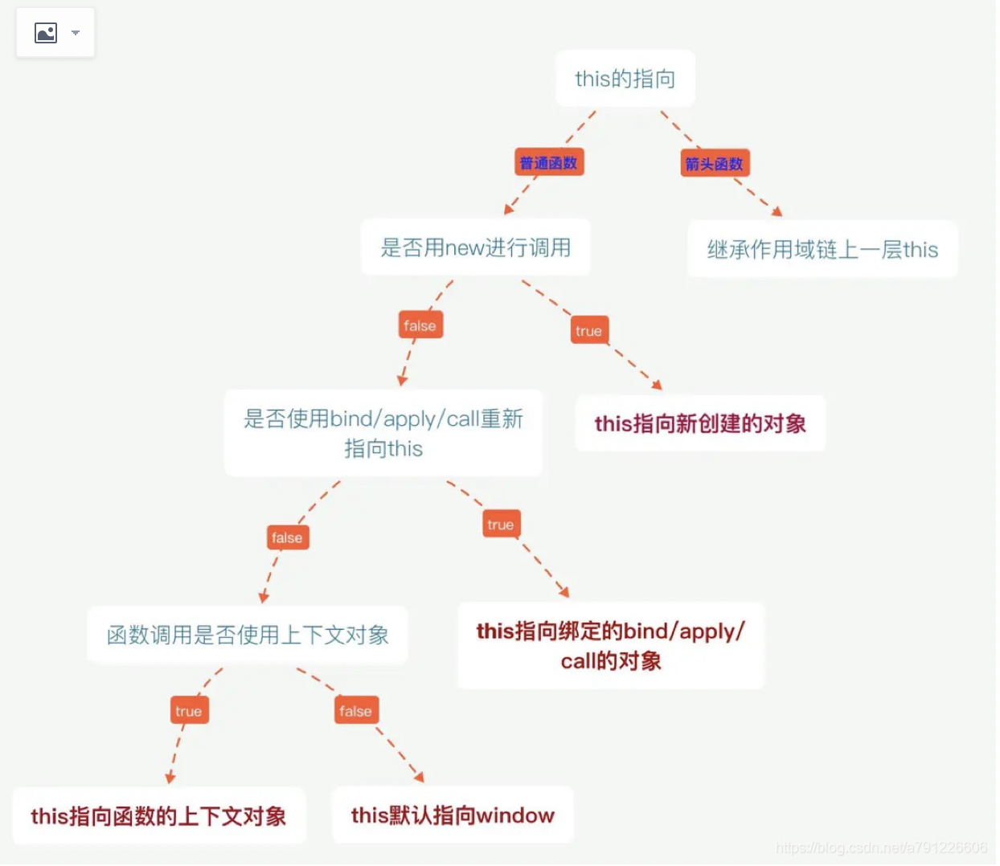
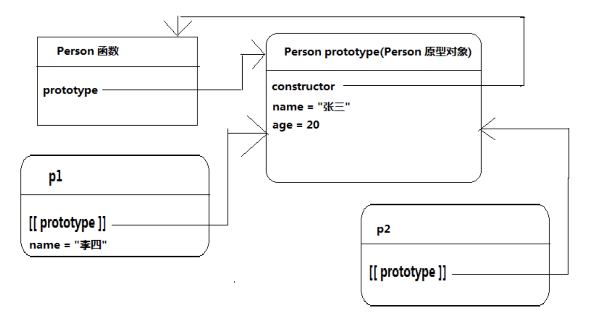
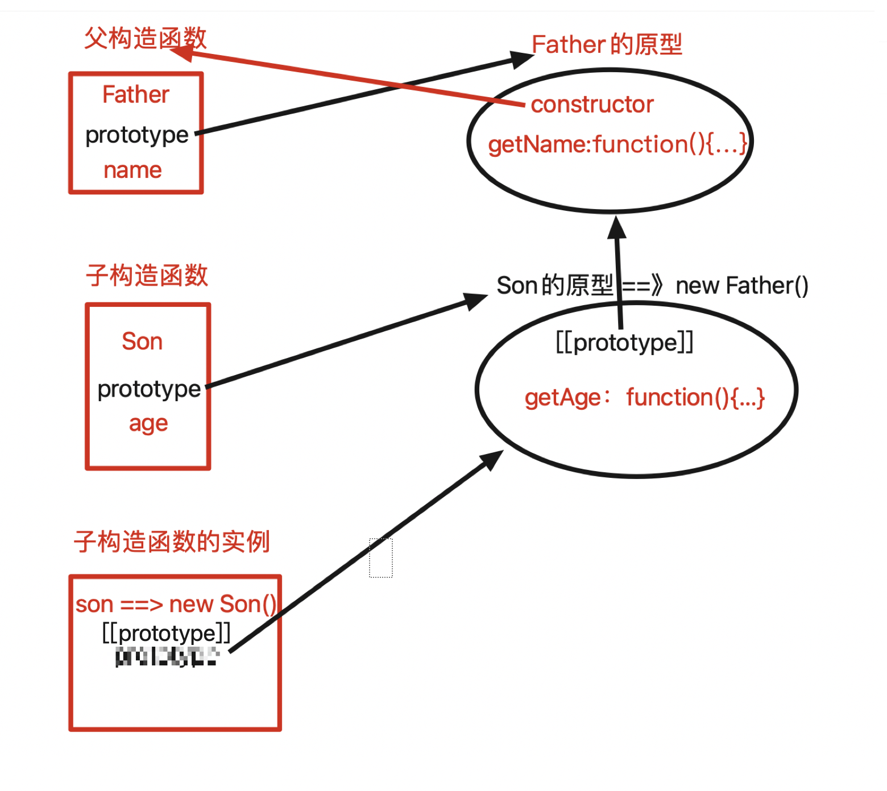

### this指向问题

**this的指向在函数定义的时候是确定不了的，只有函数执行的时候才能确定this到底指向谁，实际上this的最终指向的是那个调用它的对象**



### 作用域

每个函数都有自己的执行环境，当执行流进入一个函数时，函数的执行环境就会被推入一个执行环境栈中。而在函数执行之后，栈将执行结束的函数的执行环境弹出，把控制权返回给之前的执行环境。活动对象是在函数调用时创建的一个内部变量，执行环境定义了变量或函数有权访问的其他数据，决定了它们各自的行为。

### 闭包

**闭包可以解决函数外部无法访问函数内部变量的问题**

**通过闭包我们可以让函数中的变量持久保持，和JS回收机制有关联**

定义一个函数，外部每次调用该函数都是创建一个新的函数，和上一个函数的调用没有任何关联

```js
function fn(){
   var num = 5;
   num+=1;
   alert(num);
 }　　
fn(); //6
fn(); //6
```

使用闭包：我们首页定义了一个fn函数，里面有个num默认为0，接着返回了一个匿名函数（也就是没有名字的函数）。我们在外部用f接收这个返回的函数。这个匿名函数干的事情就是把num加1，还有我们用来调试的alert。

```js
function fn(){
  var num = 0;
　return function(){
　　num+=1;
    alert(num);　　　
  };　　
 }
 var f = fn();
 f(); //1
 f(); //2
```

这里之所以执行完这个函数num没有被销毁是因为那个匿名函数的问题，因为这个匿名函数用到了这个num，所以没有被销毁，一直保持在内存中，因此我们f()时num可以一直加。


### JS原型对象的理解

#### 有关原型对象的三个重要属性：

protopyte（显式原型）：专属于函数（除箭头函数）的一个属性，原型对象，用来给将来new出来的实例作为父级使用

__ proto __ （隐式原型）:用于指向构造当前实例的构造函数中的prototype，隐式的自调用，可以通过它获取到prototype中的属性和方法

constructor（protopyte专属）：标识当前protopyte所对应的构造函数。

使用构造函数和原型时：将属性写在构造函数中，将方法写在原型中并且在原型中使用constructor来指向前面的构造函数。

```js
// 构造函数
function Fn(name,age){
  // 属性
  this.name = name;
  this.age = age;
}
// 原型对象 内部是key-value形式
Fn.prototype = {
  //反过来引用自身构造函数
  constructor : Fn,
  // 方法
  FnName:function(){
    console.log("@@name="+this.name);
  },
  FnAge:function(){
    console.log("@@age="+this.age);
  }
}
var fnObject = new Fn("wxm",24);
console.log(fnObject.name);	//wxm
console.log(fnObject.age);	//24
fnObject.FnName(fnObject);	//@@name=wxm
fnObject.FnAge(fnObject);		//@@age=24
```

总结上面的例子：每个对象函数有名为protopyte属性，用于引用原型对象，此原型对象上又有constructor属性反过来引用函数本身，这是一种循环引用。

```js
Fn.prototype.constructor === Fn //true
fnObject.__proto__.constructor === Fn //true
```


#### 函数的原型对象：

​	在JavaScript中，我们创建一个函数A对应的浏览器内存中会创建一个对象B，每个函数都会有一个默认的属性：prototype指向对应生成的对象，这个对象B我们称为函数A的原型对象，对象B中存在一个默认属性constructor反过来指向给函数A。

​	当使用构造函数创建new对象时，被创建的对象默认有一个隐式属性 __ proto __ 指向其父构造函数的原型对象，这个属性也被[[prototype]]表示，**这个是对象的继承原型链**




### 继承

JavaScript继承是在原型链上面实现的，原型链：其基本思想是利用原型让一个引用类型继承另一个引用类型的数据和方法。

回顾构造函数，原型对象，对象之间的关系：每个构造函数都有一个prototype属性指向对应的原型对象，原型对象中又存在constructor反过来指向构造函数，每次new创建出来的新对象都有一个默认的属性[[prototype]]指向父构造函数的原型，当调用新对象的方法或属性的时候，是先在该对象上面查找，若是找不到会通过隐式原型属性[[prototype]]去向父查找，直至找到或不存在。

#### 更换构造函数的原型

原型其实是一个对象，通常是浏览器自动帮我们创建的，而且自动的将构造函数的prototype指向这个新创建的原型对象，我们完全可以将原型对象修改为我们自己定义的一个对象。

```js
// 创建一个父构造函数，定义一些属性
function Father(){
  this.name = "wxm";
};
//	给Father的原型对象上添加一个新的方法
Father.prototype.getName = function(){
  console.log(this.name);
}
//	创建另一个子构造函数，定义一些子的属性
function Son(){
  this.age = 18;
}
//	将子构造函数的原型手动的指向父构造函数的示例对象（更改了构造函数的原型）
Son.prototype = new Father();
//	给子的原型对象上添加方法
Son.prototype.getAge = function(){
  console.log(this.age);
}
//	创建Son的实例对象，该对象既继承了Son的方法和属性，也继承了Father的属性和方法
var son = new Son();
console.log(son.name);
console.log(son.age);
son.getName();
son.getAge();
```



Mac修改