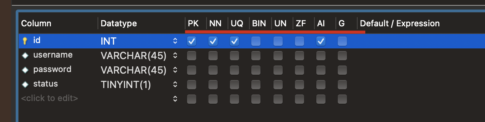
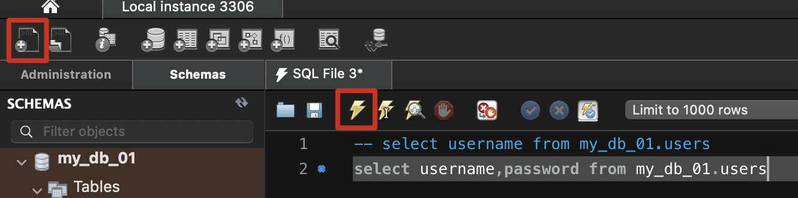
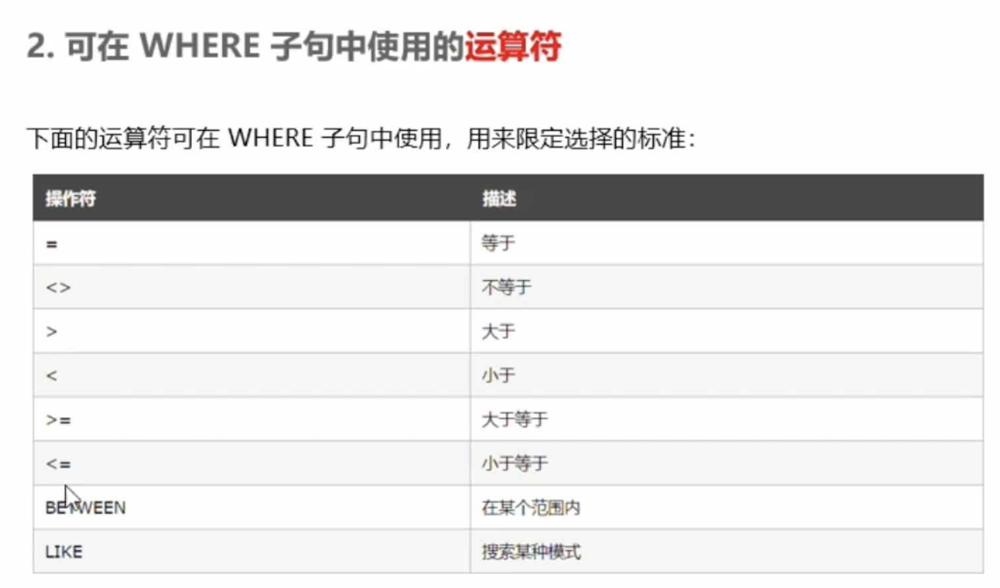

#### MySQL Workbench 管理数据库：



PK：（Primary key）主键，唯一标识

NN：（Not Null）值不允许为空

UQ：（Unique）值唯一

AI：（Auto increment）值自动增长

Default Expression：默认值

```sql
CREATE TABLE `my_db_01`.`users` (
  `id` INT NOT NULL AUTO_INCREMENT COMMENT '用户信息的唯一标识',
  `username` VARCHAR(45) NOT NULL COMMENT '用户名',
  `password` VARCHAR(45) NOT NULL COMMENT '登录密码',
  `status` TINYINT(1) NOT NULL DEFAULT 0 COMMENT '用户状态，是一个布尔值：TINYINT(1)；\n0：正常   1：禁用',
  PRIMARY KEY (`id`),
  UNIQUE INDEX `id_UNIQUE` (`id` ASC) VISIBLE,
  UNIQUE INDEX `username_UNIQUE` (`username` ASC) VISIBLE)
COMMENT = '用户信息表；';
```


#### SQL：

是一门数据库编程语言

使用SQL写出的代码是SQL语句

它只能在关系型数据库中使用，（非关系 MongoDB）


#### SQL操作（关键字对大小写不敏感）

查询：SELECT 语句用于从表中查询数据，执行的结果被存储在一个结果表里

```sql
-- 这是SQL语法注释 从FROM 指定的表中查询 * 所有数据
SELECT * FROM 表名称
-- 从FROM 指定的表中查询 列名称（字段）的数据
SELECT 列名称 FROM 表名称
```




插入：INSERT INTO 用于向数据表中插入新的数据行

```sql
-- 向指定的表中插入几列数据，列的值通过 values 一一指定
-- 注意：列的值要一一对应，多个列和多个值之间使用英文的逗号隔开
-- insert into table_name(列1，列2，...) values (值1，值2，...)
insert into users(username,password) values('老六','123');
select * from users
```

更新修改：update 用于修改表中数据

```sql
-- update指定要更新的表，set 指定列对应的新值，用where指定更新的条件
-- update 表名称 set 列名称 = 新值 where 列名称 = 某值
-- 将用户表里面用户名为 wxm 的密码改成 123
update users set password='123' where username='wxm';
-- 更新多个数据值
update users set password='123'，status=1 where username='wxm';
```

删除：delete 用于删除表中行数据

```sql
-- 从指定的表名中删除满足条件的行
-- delete from 表名 where 列名称=值
delete from users where username='老六';
```

限制条件：where



and  or 在where 语句中连接多个条件限制

and：必须满足多个条件相当于 &&

or：满足一个条件即可，相当于 || 

```sql
UPDATE users SET status = '1' WHERE username = 'wxm1' OR id='1';
```

ORDER BY：根据指定的列对结果集进行排序，默认是升序排序，要降序排序使用 DESC关键字

```sql
-- ASC：默认升序排序； DESC：降序排序
SELECT * FROM users ORDER BY username ASC;
SELECT * FROM users ORDER BY username DESC;
```

