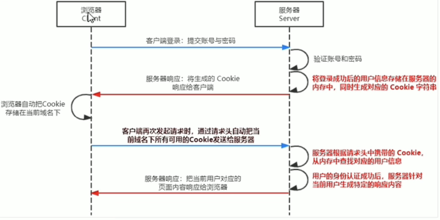
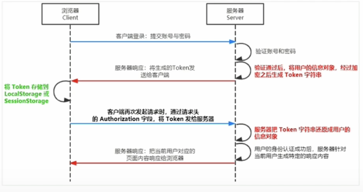

#### Session 认证机制：

HTTP 协议是无状态性的，每次的请求都是独立的，连续多个请求之间没有直接关系，服务器不会主动保留每次HTTP的请求状态

cookie：是存储在用户浏览器里的一小段字符串，它是由name value 和其他几个控制cookie的时效性，安全性，使用范围的可选属性组成的

不同域名下的cookie是相互独立的，在访问不同域名的时候会自动的将对应域名下的未过期的cookie一同发送到服务器

cookie特性：

1. 自动发送
2. 域名独立
3. 有时效性，会过期
4. 大小不超过4KB

cookie在身份认证中的作用：

客户端在第一次请求服务端，服务端会在响应头中把cookie给返回到客户端，客户端存储在本地的浏览器中，在后面请求时，客户端浏览器会自动的将cookie携带到请求头里，服务端接收后解析判断用户身份。

cookie 不具有安全性，不能将重要的数据存放在cookie中，

提高身份认证的安全性：增加服务端校验cookie

#### Session 工作机制

#### JWT工作机制

JWT组成不封：（它们之间使用 . 分割）

Header：头部   安全性相关，保证token的安全

Payload：有效载荷  是真正的用户信息，是经过服务端加密生成的字符串

​		Signaturn：签名  安全性相关，保证token的安全

JWT安装使用：npm install jsonwebtoken  express-jwt

jsonwebtoken：用于生成 JWT 字符串

express-jwt：用于将JWT字符串解析还原成JSON对象 

项目学习地址：http://escook.cn:8088/#/mds/1.init